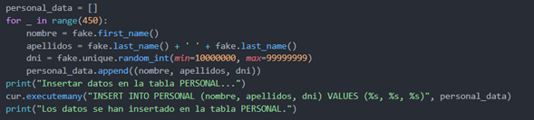

# PROJECTO PROG I BD

## **Diseño ER - Modelo Relacional**

### Modelo relacional (texto)

[Model relacional.pdf](image/PROJECTOPROGIBD/Model_relacional.pdf)

### Modelo entidad relación (imagen)

presentación de la base de datos en modelo entidad relación:


### SQL

para la creación de la base de datos de la empresa se empleo la siguiente sentencia SQL:

```sql
DROP TABLE IF EXISTS QUIROFANO_VISITADA CASCADE;
DROP TABLE IF EXISTS HABITACION_VISITADA CASCADE;
DROP TABLE IF EXISTS HISTORIAL_MEDICO CASCADE;
DROP TABLE IF EXISTS RES_VIS CASCADE;
DROP TABLE IF EXISTS ENFERMERA CASCADE;
DROP TABLE IF EXISTS VARIO CASCADE;
DROP TABLE IF EXISTS MEDICO CASCADE;
DROP TABLE IF EXISTS PERSONAL CASCADE;
DROP TABLE IF EXISTS QUIROFANO CASCADE;
DROP TABLE IF EXISTS HABITACION CASCADE;
DROP TABLE IF EXISTS EQUIPA CASCADE;
DROP TABLE IF EXISTS PACIENTE CASCADE;
DROP TABLE IF EXISTS PLANTA CASCADE;
DROP TABLE IF EXISTS DIAGNOSTICO CASCADE;

CREATE TABLE DIAGNOSTICO (
    codigo_diagnostico SERIAL PRIMARY KEY,
    nombre_diagnostico VARCHAR(100) NOT NULL,
    descripcion TEXT,
    causa TEXT,
    tratamiento TEXT
);

CREATE TABLE PLANTA (
    numero_planta SERIAL PRIMARY KEY
);

CREATE TABLE PACIENTE (
    dni_paciente VARCHAR(20) PRIMARY KEY,
    nombre VARCHAR(50) NOT NULL,
    apellidos VARCHAR(100) NOT NULL
);

CREATE TABLE EQUIPA (
    id_equipamiento SERIAL PRIMARY KEY,
    nombre_equipo VARCHAR(100) NOT NULL,
    marca VARCHAR(50),
    modelo VARCHAR(50),
    año_fabricacion INT,
    estado VARCHAR(20),
    ubicacion_actual VARCHAR(100)
);

CREATE TABLE HABITACION (
    numero_habitacion SERIAL PRIMARY KEY,
    numero_planta INT NOT NULL,
    id_equipamiento INT NOT NULL,
    FOREIGN KEY (numero_planta) REFERENCES PLANTA(numero_planta),
    FOREIGN KEY (id_equipamiento) REFERENCES EQUIPA(id_equipamiento)
);

CREATE TABLE QUIROFANO (
    id_quirofano VARCHAR(3) PRIMARY KEY,
    numero_planta INT NOT NULL,
    id_equipamiento INT NOT NULL,
    FOREIGN KEY (numero_planta) REFERENCES PLANTA(numero_planta),
    FOREIGN KEY (id_equipamiento) REFERENCES EQUIPA(id_equipamiento)
);

CREATE TABLE PERSONAL (
    id_personal SERIAL PRIMARY KEY,
    nombre VARCHAR(20) UNIQUE NOT NULL,
    apellidos VARCHAR(30) NOT NULL,
    dni VARCHAR(30) NOT NULL
);

CREATE TABLE MEDICO (
    id_medico SERIAL PRIMARY KEY,
    id_personal INT UNIQUE NOT NULL,
    estudios VARCHAR(50) NOT NULL,
    especialidad VARCHAR(70),
    curriculum VARCHAR(70),
    FOREIGN KEY (id_personal) REFERENCES PERSONAL(id_personal)
);

CREATE TABLE VARIO (
    id_vario SERIAL PRIMARY KEY,
    id_personal INT UNIQUE NOT NULL,
    tipo VARCHAR(30),
    FOREIGN KEY (id_personal) REFERENCES PERSONAL(id_personal)
);

CREATE TABLE ENFERMERA (
    id_enfermera SERIAL PRIMARY KEY,
    id_personal INT UNIQUE NOT NULL,
    id_medico INT UNIQUE,
    anos_de_experiencia INT CHECK (anos_de_experiencia >= 0),
    numero_planta INT,
    FOREIGN KEY (id_personal) REFERENCES PERSONAL(id_personal),
    FOREIGN KEY (id_medico) REFERENCES MEDICO(id_medico),
    FOREIGN KEY (numero_planta) REFERENCES PLANTA(numero_planta)
);

CREATE TABLE RES_VIS (
    id_visita SERIAL PRIMARY KEY,
    id_personal INT NOT NULL,
    dni_paciente VARCHAR(20) NOT NULL,
    FOREIGN KEY (id_personal) REFERENCES PERSONAL(id_personal),
    FOREIGN KEY (dni_paciente) REFERENCES PACIENTE(dni_paciente)
);

CREATE TABLE HISTORIAL_MEDICO (
    id_historial SERIAL PRIMARY KEY,
    id_visita INT NOT NULL,
    id_personal_doctor INT NOT NULL,
    codigo_diagnostico INT,
    fecha VARCHAR(20) NOT NULL,
    dni_paciente VARCHAR(20) NOT NULL,
    medicamentos_recibidos TEXT,
    FOREIGN KEY (id_personal_doctor) REFERENCES PERSONAL(id_personal),
    FOREIGN KEY (codigo_diagnostico) REFERENCES DIAGNOSTICO(codigo_diagnostico),
    FOREIGN KEY (dni_paciente) REFERENCES PACIENTE(dni_paciente),
    FOREIGN KEY (id_visita) REFERENCES RES_VIS(id_visita)
);

CREATE TABLE HABITACION_VISITADA (
    id_visita INT NOT NULL,
    id_habitacion INT NOT NULL,
    PRIMARY KEY (id_visita, id_habitacion),
    FOREIGN KEY (id_visita) REFERENCES RES_VIS(id_visita),
    FOREIGN KEY (id_habitacion) REFERENCES HABITACION(numero_habitacion)
);

CREATE TABLE QUIROFANO_VISITADA (
    id_visita INT NOT NULL,
    id_quirofano VARCHAR(3) NOT NULL,
    PRIMARY KEY (id_visita, id_quirofano),
    FOREIGN KEY (id_visita) REFERENCES RES_VIS(id_visita),
    FOREIGN KEY (id_quirofano) REFERENCES QUIROFANO(id_quirofano)
);

-- Добавление внешнего ключа к таблице HABITACION
ALTER TABLE HABITACION
ADD CONSTRAINT fk_numero_planta FOREIGN KEY (numero_planta) REFERENCES PLANTA(numero_planta);

ALTER TABLE HABITACION
ADD CONSTRAINT fk_id_equipamiento FOREIGN KEY (id_equipamiento) REFERENCES EQUIPA(id_equipamiento);

-- Добавление внешнего ключа к таблице QUIROFANO
ALTER TABLE QUIROFANO
ADD CONSTRAINT fk_numero_planta_quirofano FOREIGN KEY (numero_planta) REFERENCES PLANTA(numero_planta);

ALTER TABLE QUIROFANO
ADD CONSTRAINT fk_id_equipamiento_quirofano FOREIGN KEY (id_equipamiento) REFERENCES EQUIPA(id_equipamiento);

-- Добавление внешнего ключа к таблице MEDICO
ALTER TABLE MEDICO
ADD CONSTRAINT fk_id_personal_medico FOREIGN KEY (id_personal) REFERENCES PERSONAL(id_personal);

-- Добавление внешнего ключа к таблице VARIO
ALTER TABLE VARIO
ADD CONSTRAINT fk_id_personal_vario FOREIGN KEY (id_personal) REFERENCES PERSONAL(id_personal);

-- Добавление внешнего ключа к таблице ENFERMERA
ALTER TABLE ENFERMERA
ADD CONSTRAINT fk_id_personal_enfermera FOREIGN KEY (id_personal) REFERENCES PERSONAL(id_personal);

ALTER TABLE ENFERMERA
ADD CONSTRAINT fk_id_medico_enfermera FOREIGN KEY (id_medico) REFERENCES MEDICO(id_medico);

ALTER TABLE ENFERMERA
ADD CONSTRAINT fk_numero_planta_enfermera FOREIGN KEY (numero_planta) REFERENCES PLANTA(numero_planta);

-- Добавление внешнего ключа к таблице RES_VIS
ALTER TABLE RES_VIS
ADD CONSTRAINT fk_id_personal_res_vis FOREIGN KEY (id_personal) REFERENCES PERSONAL(id_personal);

ALTER TABLE RES_VIS
ADD CONSTRAINT fk_dni_paciente_res_vis FOREIGN KEY (dni_paciente) REFERENCES PACIENTE(dni_paciente);

-- Добавление внешнего ключа к таблице HISTORIAL_MEDICO
ALTER TABLE HISTORIAL_MEDICO
ADD CONSTRAINT fk_id_visita_historial FOREIGN KEY (id_visita) REFERENCES RES_VIS(id_visita);

ALTER TABLE HISTORIAL_MEDICO
ADD CONSTRAINT fk_id_personal_doctor FOREIGN KEY (id_personal_doctor) REFERENCES PERSONAL(id_personal);

ALTER TABLE HISTORIAL_MEDICO
ADD CONSTRAINT fk_codigo_diagnostico_historial FOREIGN KEY (codigo_diagnostico) REFERENCES DIAGNOSTICO(codigo_diagnostico);

ALTER TABLE HISTORIAL_MEDICO
ADD CONSTRAINT fk_dni_paciente_historial FOREIGN KEY (dni_paciente) REFERENCES PACIENTE(dni_paciente);

-- Добавление внешнего ключа к таблице HABITACION_VISITADA
ALTER TABLE HABITACION_VISITADA
ADD CONSTRAINT fk_id_visita_habitacion FOREIGN KEY (id_visita) REFERENCES RES_VIS(id_visita);

ALTER TABLE HABITACION_VISITADA
ADD CONSTRAINT fk_id_habitacion_habitacion FOREIGN KEY (id_habitacion) REFERENCES HABITACION(numero_habitacion);

-- Добавление внешнего ключа к таблице QUIROFANO_VISITADA
ALTER TABLE QUIROFANO_VISITADA
ADD CONSTRAINT fk_id_visita_quirofano FOREIGN KEY (id_visita) REFERENCES RES_VIS(id_visita);

ALTER TABLE QUIROFANO_VISITADA
ADD CONSTRAINT fk_id_quirofano_quirofano FOREIGN KEY (id_quirofano) REFERENCES QUIROFANO(id_quirofano);

```

## Esquema de seguridad

### Instalacion y configuración ssl

- para la instalacion del ssl es necesario hacer las siguientes comprobaciones:
- PostgreSQL instalado
- Comprobar conexión a internet  a la base de datos
- Actualizar repositorios (apt update + apt upgrade)
- comprobar si el ssl esta instalado lo cual en las versiones actuales de postgres ya viene con un ssl por defecto solo falta configurarlo.

1. Configuración de PostgreSQL para SSL

Primero generaremos un certificado SSL con una herramienta llamada openssl:

Vamos a la ruta donde se encuentra el archivo de configuración de PostgreSQL, una vez dentro podemos crear una carpeta y dentro de ella crear los certificados. En mi caso, no la creé sino que los hice en el directorio principal donde está el archivo de configuración.


Para generar la clave privada ejecutamos los comandos en la ruta mencionada anteriormente:

```bash
openssl genrsa -aes128 2048 > server.key
```

Esta orden genera la clave privada con la opción de encriptación especificada que es -aes128 y en un tamaño de clave privada de 2048 bits. Todo esto se generará con el nombre y la extensión especificada que es server.key.

esto especifica el nombre del fichero de entrada para leer una clave, una vez hecha con la opcion -out podemos escribir una clave para esta:

```bash
openssl rsa -in server.key -out server.key
```


Una vez hecho podemos proceder a cambiar los permisos del fichero y el propietario como  se muestra en la imagen.


- Chmod 400 server.key : con este comando cambiamos los permisos porque el propietario del archivo tiene permisos de lectura.
- chown postgres:postgres server.key : cambia el propietario y el grupo al usuario postgres.

Una vez hecho esto se ejecuta el comando:

```
openssl req -new -key server.key -days 365 -out server.crt - x509
```

Después de ejecutar el pedido no pedirá rellenar unos datos, rellenamos los que creemos convenientes, después de terminar de rellenar, copiamos el archivo server.crt y creamos una copia con otro número:

cp server.crt root.crt

Una vez generados los cambios anteriores, procedemos a configurar para que se use el certificado y la clave generada en la ruta de configuración de PostgreSQL, en mi caso la ruta es /etc/postgresql/15/main/postgresql.conf y buscamos el apartado -SSL- como se llega a apreciar


IMPORTANTE:

Dentro del fichero buscamos el apartado - SSL – y verificamos si el ssl es donde, donde pone ssl_ca_file ponemos la ruta del fichero root.crt, en el ssl_cert_file ponemos la ruta del fichero server.crt y por último ponemos a ssl_key_file la ruta del fichero server.key, luego descomentamos el ssl_ciphers, ssl_prefer_server_ciphers y guardamos.

Ahora configuramos el fichero pg_hba.conf y añadimos al final del fichero la siguiente línea:


Una vez modificado y guardado reiniciamos el servicio de postgres.
Sudo systemctl restart postgresql o sudo service postgresql restart

---

COMPROVACIONES

**SSL ON:**


**SSL OFF:**


**SSL CON RUTA ERRONEA: se recomienda usar la ruta absoluta para indicar la ubicacion de la clave.**


### Documento AGPD

**Documento de Seguridad de Datos - Hospital Blanes**

El presente documento establece las medidas de seguridad implementadas
por el Hospital Blanes para proteger los datos personales y confidenciales de
los pacientes, así como los datos del personal del hospital. Este documento se
elabora en cumplimiento de la normativa de protección de datos de la Agencia
Española de Protección de Datos (AGPD) y tiene como objetivo garantizar la
confidencialidad, integridad y disponibilidad de la información médica y
personal.

**El Hospital Blanes maneja diversos tipos de datos, entre los que se
incluyen:**

* Datos personales de los pacientes: nombres, números de seguro social,
  direcciones, números de teléfono, entre otros.
* Datos personales del personal del hospital: nombres, números de
  identificación, información de contacto, entre otros.
* Historiales médicos y diagnósticos de los pacientes entre otros.

Se ha realizado un análisis de riesgos para identificar las posibles
amenazas y vulnerabilidades que podrían afectar la seguridad de los datos en el
Hospital [Nombre del Hospital]. Algunas de las amenazas identificadas incluyen:

* Acceso no autorizado a los registros médicos de los pacientes.
* Divulgación no autorizada de información personal y médica del personal del hospital.
* Riesgo de pérdida de datos debido a fallos en sistemas de almacenamiento
  o copias de seguridad.
* Riesgo de violación de la privacidad de los pacientes debido a la
  revelación no autorizada de historiales médicos y diagnósticos.

**Medidas de Seguridad Implementadas**

Para proteger los datos mencionados, el Hospital Blanes ha implementado
las siguientes medidas de seguridad:

- Acceso restringido a los sistemas de gestión de datos, utilizando
  autenticación de dos factores y controles de acceso basados en roles.
- Cifrado de datos sensibles, como historiales médicos y diagnósticos,
  tanto en almacenamiento como en transmisión.
- Implementación de políticas de privacidad y seguridad de la información,
  con capacitación regular del personal en prácticas de seguridad.
- Auditorías periódicas de seguridad internas y externas para evaluar la
  eficacia de las medidas de seguridad implementadas.
- Realización de copias de seguridad regulares de los datos, con
  almacenamiento seguro fuera del sitio.

Las medidas de seguridad implementadas están diseñadas para proteger la
confidencialidad, integridad y disponibilidad de los datos personales y médicos
en el Hospital Blanes. Estas medidas se justifican en función de cumplir con
los requisitos legales y normativos de protección de datos, así como para
garantizar la confianza y privacidad de los pacientes y el personal del
hospital.

Este documento de seguridad será revisado periódicamente para garantizar
su relevancia y eficacia en la protección de los datos del Hospital Blanes. Se
realizarán actualizaciones según sea necesario para reflejar cambios en los
riesgos de seguridad y en las medidas de seguridad disponibles.

## Esquema de alta disponibilidad

**Servidor principal:**

    HPE ProLiant DL380 Gen10.

    Especificaciones – CPU Intel Xeon escalable 4210 con 10 núcleos a 2.2 HZ

    Memoria RAM: 64GB DDR4 (4modulos de 16 GB)

    almacenamiento: 100 TB en configuración RAID 10 (ampliable)

**Portátil:**

    Marca: HP

    Sistema operativo: Debian 12 sin interfaz grafica

**JUSTIFICACIÓN:**

La elección del servidor HPE ProLiant DL380 Gen 10 se basa en su velocidad y  fiabilidad. Este servidor ofrece un rendimiento superior, integrando características avanzadas de gestión y seguridad. La memoria RAM de 64 GB permite el manejo eficiente de grandes conjuntos de datos y facilita la ejecución fluida de aplicaciones exigentes. Además, el almacenamiento RAID 10 de 100 TB proporciona una sólida protección de datos y garantiza una alta disponibilidad del sistema, minimizando el tiempo de inactividad.

**Servidor respaldo:**

    Servidor en la nube (aws)Amazon Elástic compute cloud (Amazon EC2)

    CPU contratado 8 núcleos CPU

    4 memoria RAM 64GB

    Almacenamiento 100 TB.

**Justificación:**

Se ha elegido esta configuración debido a su alta escalabilidad y disponibilidad, lo que garantiza que el servidor de respaldo pueda crecer según las necesidades del hospital y esté siempre disponible cuando se necesite. Además, AWS ofrece una garantía de disponibilidad del 99,99%, lo que proporciona una capa adicional de confiabilidad y seguridad para los datos del hospital.

**Sistema de redundancia y replicación
Configuración (activo-pasivo) mecanismo asíncrono.**

Se ha establecido una configuración activo-pasivo, donde el servidor físico actúa como servidor principal y el servidor en la nube funciona como servidor secundario. La replicación de datos se realiza de manera asíncrona, lo que significa que la sincronización entre los servidores ocurre eventualmente, por eventos.

**Justificación:**

Esta configuración ofrece una combinación de
alta disponibilidad, tolerancia a fallos y capacidad de respuesta del sistema, lo que la hace ideal para respaldar las necesidades críticas de datos del hospital. Aunque tiene sus contras, como costos adicionales y complejidad de configuración, pero los beneficios en términos de seguridad y continuidad del servicio superan ampliamente estas consideraciones.

**Configuración activo-pasivo:**

En esta configuración, el servidor principal se encuentra en el hospital de Blanes y actúa como el nodo activo, encargado de todas las operaciones de lectura y escritura. Este nodo es el punto central de la infraestructura y maneja todas las tareas críticas para el funcionamiento
del sistema.

Por otro lado, el segundo nodo se encuentra en la nube (cloud) y opera como el nodo pasivo. En este caso, el servidor en la nube permanece inactivo la mayor parte del tiempo, solo activándose en caso de que el nodo principal en el hospital falle o experimente algún problema. En tal situación, el servidor en la nube asume automáticamente las funciones del
servidor principal para garantizar la continuidad del servicio y minimizar cualquier impacto en las operaciones del hospital.

### Diagrama de funcionamiento:


### Manual de instalacion y como se administran de los servidores

1. Instalación del Servidor Físico en el hospital:

* Determinas el hardware y sistema operativo del servidor físico. En nuestro caso es Debian12.
* Configuración de la red del servidor para que esté conectada a la misma red que los usuarios del hospital.
* Instalar Software necesario para llevar la gestión del hospital.

2. Configurar el servidor de Réplica en la Nube en Amazon

- Crear la cuenta de AWS
- Lanzar una instancia EC2
- Configuración de la seguridad. Hay que
  destacar que es muy importante tener unos estándares de seguridad altos ya que
  tratamos con datos personales de pacientes.
- Instalación del software necesario en la
  instancia EC2. Herramientas de monitorización, software de respaldo, etc.
- Configuración de la Replicación de Datos.
  Los datos al replicarse en ambos servidores tienen que estar disponibles por si
  uno de ellos cae.

3. Administrar ambos servidores

* Monitorizar ambos servidores
* Gestionar de usuarios y permisos
* Configuración de las copias de Seguridad

- Configurar la seguridad en ambas maquinas.
  Como firewalls, VPN, detección de intrusiones.

4. Técnica de balanceo

- Podemos utilizar la técnica “Route 53
  Latency Based Rotuing” que proporciona AWS. Esta técnica aprovecha la red para
  dirigir el tráfico de los usuarios al servidor que tenga menos latencia.

### Configuracion para tener alta disponibilidad de sistema de backup

Primero creamos la máquina virtual y configuramos el postgres

Una vez creada, la replicamos en otra MV para poder tener alta disponibilidad.

Pasos para tener alta disponibilidad:

En el nodo principal creamos el usuario de replicación y le damos privilegios de replicación


Una vez hecho vamos a los siguientes fichero de configuración: postgresql.conf des comentamos las siguientes líneas:

Abrimos el fichero


Configuramos la dirección ip que escuchara, podemos poner la ip ao localhost, en mi caso pondré la ip.


Habilitar la replicación WAL: Aseguramos que el servidor principal esté escribiendo los registros WAL.

Esta opción permite a postgres que escriba todo el contenido de cada pagina del disco en el archivo WAL.


Una vez hecho los cambios guardamos y vamos al siguiente fichero en la misma ruta: pg_hba.conf


Una vez dentro crearemos una línea la cual permitirá al nodo secundario conectándose con el usuario replica_user


Guardamos los cambios y pasamos al nodo secundario, una vez en el paramos el servicio
postgresql con **systemctl stop portgresql.**

Una vez parado el servicio ponemos y ejecutamos la siguiente comanda:


Esta comanda elimina todos los archivos en el directorio de datos de la réplica para comenzar desde cero y dejar espacio para el directorio de datos del nodo principal.

Después de que termine de eliminar los archivos ponemos la siguiente comanda:


Este comando realiza una copia de seguridad de una base de datos PostgreSQL en un servidor remoto utilizando un flujo de datos continuo, habilita la configuración de replicación y almacena los datos de copia de seguridad en el directorio especificado.

Después de que termine le otorgaremos la propiedad del directorio de datos al usuario
postgres con la siguiente comanda:


Una vez hecho ponemos en marcha el servicio postgres con **systemctl start portgresql **y comprobamos su estado con **systemctl status portgresql.**


COMPROVACION REPLICA:

podemos apreciar en la siguiente imagen en la parte izquierda se encuentra el
nodo principal y la parte derecha es el nodo secundario.


Para demostrar que la replica que hace de manera efectiva creare una tabla con un
insert pequeño.


Se creo una base de datos llamada bd_prueba la cual esta conectada al nodo principal


Como podemos apreciar la ejecución se hizo correctamente, ahora comprobaremos las bases de datos.


### Instalacion y configuracion backups

Instalamos cron una herramienta la cual nos permite crear tareas y que se ejecuten de manera automática.

1. Sudo apt update
2. Sudo apt install cron

Para poder acceder al fichero donde se crearán las tareas:

Crontab -e

**Creación y configuración del script de backup:**

En le apartado **variables **se
configuraron datos necesarios para que el script pueda acceder a la base de
datos para asi buscar y crear la copia de seguridad.

La función backup logico genera copia de la
base de datos especificada (DB) la cual es la principal base de datos una vez
obtenida la comprime y en caso de producirse un error se crearan logs.

**Notificaciones de backup.**


Para añadir el script tiene implementado unas funciones que notificaran al usuario mediante Gmail y telegram.

Configuración del cron:


**Guardar en la nube:**

Para instalar onedrive en debian se aplicaron las siguientes comandas:

sudo -- bash -c 'apt update && apt install --yes onedrive'

una vez instalado escribimos por terminal onedrive la primera vez nos mostrara un link el cual tenemos que copiar y poner en el navegador, una vez en este tendremos que iniciar sesión y darle permiso para que acceda a la información.


Una vez terminamos de hacer lo anterior copiamos la url y la ponemos en el terminal, no retornara que la autorización ha sido un éxito.


Ahora lo sincronizamos:


Una vez terminado ahora tendremos creada una carpeta onedrive, para ver la ruta podemos hacer **onedrive --display-config,** en esa ruta se creara una carpeta para los backups.


Se añadieron dos líneas mas, una para hacer una copia del comprimido y después una para sincronizar el onedrive:


Como podemos ver el fichero se subió correctamente


## Dummy data

Explicación del funcionamiento del script Dummy data.


**CONEXIÓN CON LA BASE DE DATOS:**

Esta parte nos permite establecer conexión a la base de datos para asi ejecutar los inserts que haremos mas adelante.


**GENERACION Y INSERCION DE DATOS**

Se a utilizando la biblioteca Faker para generar datos ficticios en español para varias tablas de la base de datos. Los tipos de datos incluyen nombres, apellidos, DNIs (Documento Nacional de Identidad), estudios, especialidades, currículos, años de experiencia, tipos de personal y letras aleatorias para DNIs de pacientes, después de generarlos inserta los datos ficticios generados en las respectivas tablas de la base de datos utilizando sentencias SQL de inserción.

Parte del código como ejemplo:

**Tabla PERSONAL**



**Tabla MEDICO**


**Tabla ENFERMERA**


**Tabla VARIO**


**Tabla PACIENTE**


**Tabla RES_VIS**


**COMPROBAR SI EL ID EXISTE:**

Esta función comprueba si el id del medico existe esto se hace para garantizar la integridad de  referencia entre las tablas MEDICO Y ENFERMERA.


F**UNCION PARA ELIMINAR LOS DATOS:**

Una función para que en caso de que el usuario necesite eliminar los datos, esta función se llamara desde el menú una vez el usuario se haya verificado.


Al final del script, se solicita al usuario que confirme si desea eliminar todos los datos insertados. Si el usuario confirma, se llama a la función eliminar_datos para eliminar los datos de las tablas. Si no, los datos permanecerán en la base de datos.


