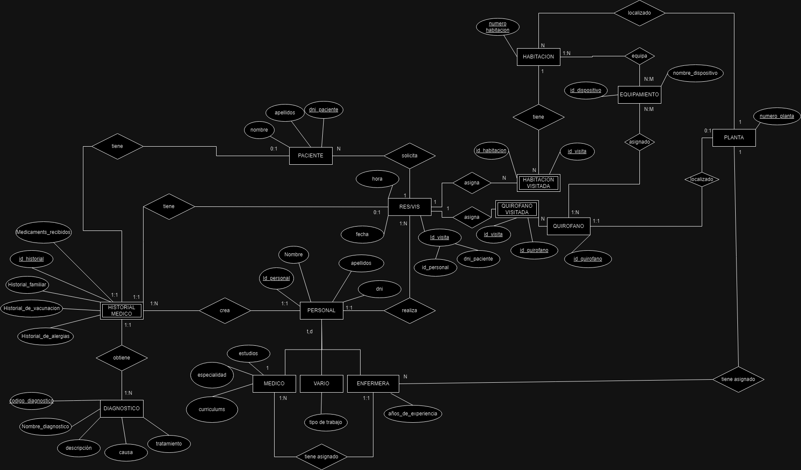
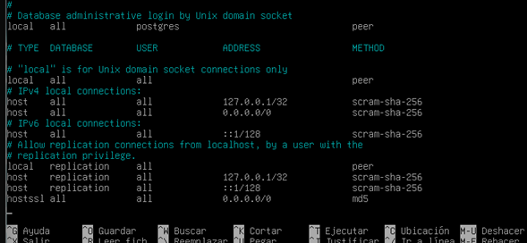
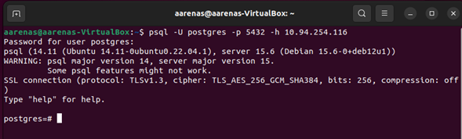
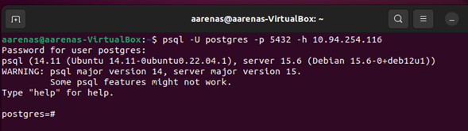
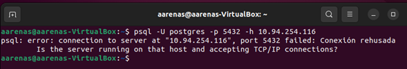

# PROJECTO PROG I BD

## **Diseño ER - Modelo Relacional**

### Modelo relacional (texto)

[Model relacional.pdf](imagenes/Model_relacional.pdf)

### Modelo entidad relación (imagen)

presentación de la base de datos en modelo entidad relación:



### SQL

para la creación de la base de datos de la empresa se empleo la siguiente sentencia SQL:

```sql
DROP TABLE IF EXISTS QUIROFANO_VISITADA CASCADE;
DROP TABLE IF EXISTS HABITACION_VISITADA CASCADE;
DROP TABLE IF EXISTS HISTORIAL_MEDICO CASCADE;
DROP TABLE IF EXISTS RES_VIS CASCADE;
DROP TABLE IF EXISTS ENFERMERA CASCADE;
DROP TABLE IF EXISTS VARIO CASCADE;
DROP TABLE IF EXISTS MEDICO CASCADE;
DROP TABLE IF EXISTS PERSONAL CASCADE;
DROP TABLE IF EXISTS QUIROFANO CASCADE;
DROP TABLE IF EXISTS HABITACION CASCADE;
DROP TABLE IF EXISTS EQUIPA CASCADE;
DROP TABLE IF EXISTS PACIENTE CASCADE;
DROP TABLE IF EXISTS PLANTA CASCADE;
DROP TABLE IF EXISTS DIAGNOSTICO CASCADE;

CREATE TABLE DIAGNOSTICO (
    codigo_diagnostico SERIAL PRIMARY KEY,
    nombre_diagnostico VARCHAR(100) NOT NULL,
    descripcion TEXT,
    causa TEXT,
    tratamiento TEXT
);

CREATE TABLE PLANTA (
    numero_planta SERIAL PRIMARY KEY
);

CREATE TABLE PACIENTE (
    dni_paciente VARCHAR(20) PRIMARY KEY,
    nombre VARCHAR(50) NOT NULL,
    apellidos VARCHAR(100) NOT NULL
);

CREATE TABLE EQUIPA (
    id_equipamiento SERIAL PRIMARY KEY,
    nombre_equipo VARCHAR(100) NOT NULL,
    marca VARCHAR(50),
    modelo VARCHAR(50),
    año_fabricacion INT,
    estado VARCHAR(20),
    ubicacion_actual VARCHAR(100)
);

CREATE TABLE HABITACION (
    numero_habitacion SERIAL PRIMARY KEY,
    numero_planta INT NOT NULL,
    id_equipamiento INT NOT NULL,
    FOREIGN KEY (numero_planta) REFERENCES PLANTA(numero_planta),
    FOREIGN KEY (id_equipamiento) REFERENCES EQUIPA(id_equipamiento)
);

CREATE TABLE QUIROFANO (
    id_quirofano VARCHAR(3) PRIMARY KEY,
    numero_planta INT NOT NULL,
    id_equipamiento INT NOT NULL,
    FOREIGN KEY (numero_planta) REFERENCES PLANTA(numero_planta),
    FOREIGN KEY (id_equipamiento) REFERENCES EQUIPA(id_equipamiento)
);

CREATE TABLE PERSONAL (
    id_personal SERIAL PRIMARY KEY,
    nombre VARCHAR(20) UNIQUE NOT NULL,
    apellidos VARCHAR(30) NOT NULL,
    dni VARCHAR(30) NOT NULL
);

CREATE TABLE MEDICO (
    id_medico SERIAL PRIMARY KEY,
    id_personal INT UNIQUE NOT NULL,
    estudios VARCHAR(50) NOT NULL,
    especialidad VARCHAR(70),
    curriculum VARCHAR(70),
    FOREIGN KEY (id_personal) REFERENCES PERSONAL(id_personal)
);

CREATE TABLE VARIO (
    id_vario SERIAL PRIMARY KEY,
    id_personal INT UNIQUE NOT NULL,
    tipo VARCHAR(30),
    FOREIGN KEY (id_personal) REFERENCES PERSONAL(id_personal)
);

CREATE TABLE ENFERMERA (
    id_enfermera SERIAL PRIMARY KEY,
    id_personal INT UNIQUE NOT NULL,
    id_medico INT UNIQUE,
    anos_de_experiencia INT CHECK (anos_de_experiencia >= 0),
    numero_planta INT,
    FOREIGN KEY (id_personal) REFERENCES PERSONAL(id_personal),
    FOREIGN KEY (id_medico) REFERENCES MEDICO(id_medico),
    FOREIGN KEY (numero_planta) REFERENCES PLANTA(numero_planta)
);

CREATE TABLE RES_VIS (
    id_visita SERIAL PRIMARY KEY,
    id_personal INT NOT NULL,
    dni_paciente VARCHAR(20) NOT NULL,
    FOREIGN KEY (id_personal) REFERENCES PERSONAL(id_personal),
    FOREIGN KEY (dni_paciente) REFERENCES PACIENTE(dni_paciente)
);

CREATE TABLE HISTORIAL_MEDICO (
    id_historial SERIAL PRIMARY KEY,
    id_visita INT NOT NULL,
    id_personal_doctor INT NOT NULL,
    codigo_diagnostico INT,
    fecha VARCHAR(20) NOT NULL,
    dni_paciente VARCHAR(20) NOT NULL,
    medicamentos_recibidos TEXT,
    FOREIGN KEY (id_personal_doctor) REFERENCES PERSONAL(id_personal),
    FOREIGN KEY (codigo_diagnostico) REFERENCES DIAGNOSTICO(codigo_diagnostico),
    FOREIGN KEY (dni_paciente) REFERENCES PACIENTE(dni_paciente),
    FOREIGN KEY (id_visita) REFERENCES RES_VIS(id_visita)
);

CREATE TABLE HABITACION_VISITADA (
    id_visita INT NOT NULL,
    id_habitacion INT NOT NULL,
    PRIMARY KEY (id_visita, id_habitacion),
    FOREIGN KEY (id_visita) REFERENCES RES_VIS(id_visita),
    FOREIGN KEY (id_habitacion) REFERENCES HABITACION(numero_habitacion)
);

CREATE TABLE QUIROFANO_VISITADA (
    id_visita INT NOT NULL,
    id_quirofano VARCHAR(3) NOT NULL,
    PRIMARY KEY (id_visita, id_quirofano),
    FOREIGN KEY (id_visita) REFERENCES RES_VIS(id_visita),
    FOREIGN KEY (id_quirofano) REFERENCES QUIROFANO(id_quirofano)
);

-- Добавление внешнего ключа к таблице HABITACION
ALTER TABLE HABITACION
ADD CONSTRAINT fk_numero_planta FOREIGN KEY (numero_planta) REFERENCES PLANTA(numero_planta);

ALTER TABLE HABITACION
ADD CONSTRAINT fk_id_equipamiento FOREIGN KEY (id_equipamiento) REFERENCES EQUIPA(id_equipamiento);

-- Добавление внешнего ключа к таблице QUIROFANO
ALTER TABLE QUIROFANO
ADD CONSTRAINT fk_numero_planta_quirofano FOREIGN KEY (numero_planta) REFERENCES PLANTA(numero_planta);

ALTER TABLE QUIROFANO
ADD CONSTRAINT fk_id_equipamiento_quirofano FOREIGN KEY (id_equipamiento) REFERENCES EQUIPA(id_equipamiento);

-- Добавление внешнего ключа к таблице MEDICO
ALTER TABLE MEDICO
ADD CONSTRAINT fk_id_personal_medico FOREIGN KEY (id_personal) REFERENCES PERSONAL(id_personal);

-- Добавление внешнего ключа к таблице VARIO
ALTER TABLE VARIO
ADD CONSTRAINT fk_id_personal_vario FOREIGN KEY (id_personal) REFERENCES PERSONAL(id_personal);

-- Добавление внешнего ключа к таблице ENFERMERA
ALTER TABLE ENFERMERA
ADD CONSTRAINT fk_id_personal_enfermera FOREIGN KEY (id_personal) REFERENCES PERSONAL(id_personal);

ALTER TABLE ENFERMERA
ADD CONSTRAINT fk_id_medico_enfermera FOREIGN KEY (id_medico) REFERENCES MEDICO(id_medico);

ALTER TABLE ENFERMERA
ADD CONSTRAINT fk_numero_planta_enfermera FOREIGN KEY (numero_planta) REFERENCES PLANTA(numero_planta);

-- Добавление внешнего ключа к таблице RES_VIS
ALTER TABLE RES_VIS
ADD CONSTRAINT fk_id_personal_res_vis FOREIGN KEY (id_personal) REFERENCES PERSONAL(id_personal);

ALTER TABLE RES_VIS
ADD CONSTRAINT fk_dni_paciente_res_vis FOREIGN KEY (dni_paciente) REFERENCES PACIENTE(dni_paciente);

-- Добавление внешнего ключа к таблице HISTORIAL_MEDICO
ALTER TABLE HISTORIAL_MEDICO
ADD CONSTRAINT fk_id_visita_historial FOREIGN KEY (id_visita) REFERENCES RES_VIS(id_visita);

ALTER TABLE HISTORIAL_MEDICO
ADD CONSTRAINT fk_id_personal_doctor FOREIGN KEY (id_personal_doctor) REFERENCES PERSONAL(id_personal);

ALTER TABLE HISTORIAL_MEDICO
ADD CONSTRAINT fk_codigo_diagnostico_historial FOREIGN KEY (codigo_diagnostico) REFERENCES DIAGNOSTICO(codigo_diagnostico);

ALTER TABLE HISTORIAL_MEDICO
ADD CONSTRAINT fk_dni_paciente_historial FOREIGN KEY (dni_paciente) REFERENCES PACIENTE(dni_paciente);

-- Добавление внешнего ключа к таблице HABITACION_VISITADA
ALTER TABLE HABITACION_VISITADA
ADD CONSTRAINT fk_id_visita_habitacion FOREIGN KEY (id_visita) REFERENCES RES_VIS(id_visita);

ALTER TABLE HABITACION_VISITADA
ADD CONSTRAINT fk_id_habitacion_habitacion FOREIGN KEY (id_habitacion) REFERENCES HABITACION(numero_habitacion);

-- Добавление внешнего ключа к таблице QUIROFANO_VISITADA
ALTER TABLE QUIROFANO_VISITADA
ADD CONSTRAINT fk_id_visita_quirofano FOREIGN KEY (id_visita) REFERENCES RES_VIS(id_visita);

ALTER TABLE QUIROFANO_VISITADA
ADD CONSTRAINT fk_id_quirofano_quirofano FOREIGN KEY (id_quirofano) REFERENCES QUIROFANO(id_quirofano);

```

## Esquema de seguridad

### Instalacion y configuración ssl

- para la instalacion del ssl es necesario hacer las siguientes comprobaciones:
- PostgreSQL instalado
- Comprobar conexión a internet  a la base de datos
- Actualizar repositorios (apt update + apt upgrade)
- comprobar si el ssl esta instalado lo cual en las versiones actuales de postgres ya viene con un ssl por defecto solo falta configurarlo.

1. Configuración de PostgreSQL para SSL

Primero generaremos un certificado SSL con una herramienta llamada openssl:

Vamos a la ruta donde se encuentra el archivo de configuración de PostgreSQL, una vez dentro podemos crear una carpeta y dentro de ella crear los certificados. En mi caso, no la creé sino que los hice en el directorio principal donde está el archivo de configuración.


Para generar la clave privada ejecutamos los comandos en la ruta mencionada anteriormente:

```bash
openssl genrsa -aes128 2048 > server.key
```

Esta orden genera la clave privada con la opción de encriptación especificada que es -aes128 y en un tamaño de clave privada de 2048 bits. Todo esto se generará con el nombre y la extensión especificada que es server.key.

esto especifica el nombre del fichero de entrada para leer una clave, una vez hecha con la opcion -out podemos escribir una clave para esta:

```bash
openssl rsa -in server.key -out server.key
```


Una vez hecho podemos proceder a cambiar los permisos del fichero y el propietario como  se muestra en la imagen.


- Chmod 400 server.key : con este comando cambiamos los permisos porque el propietario del archivo tiene permisos de lectura.
- chown postgres:postgres server.key : cambia el propietario y el grupo al usuario postgres.

Una vez hecho esto se ejecuta el comando:

```
openssl req -new -key server.key -days 365 -out server.crt - x509
```

Después de ejecutar el pedido no pedirá rellenar unos datos, rellenamos los que creemos convenientes, después de terminar de rellenar, copiamos el archivo server.crt y creamos una copia con otro número:

cp server.crt root.crt

Una vez generados los cambios anteriores, procedemos a configurar para que se use el certificado y la clave generada en la ruta de configuración de PostgreSQL, en mi caso la ruta es /etc/postgresql/15/main/postgresql.conf y buscamos el apartado -SSL- como se llega a apreciar


IMPORTANTE:

Dentro del fichero buscamos el apartado - SSL – y verificamos si el ssl es donde, donde pone ssl_ca_file ponemos la ruta del fichero root.crt, en el ssl_cert_file ponemos la ruta del fichero server.crt y por último ponemos a ssl_key_file la ruta del fichero server.key, luego descomentamos el ssl_ciphers, ssl_prefer_server_ciphers y guardamos.

Ahora configuramos el fichero pg_hba.conf y añadimos al final del fichero la siguiente línea:



Una vez modificado y guardado reiniciamos el servicio de postgres.
Sudo systemctl restart postgresql o sudo service postgresql restart

---

COMPROVACIONES

**SSL ON:**



**SSL OFF:**



**SSL CON RUTA ERRONEA: se recomienda usar la ruta absoluta para indicar la ubicacion de la clave.**



## DOCUMENTO AGPD

**Documento de Seguridad de Datos - Hospital Blanes**

El presente documento establece las medidas de seguridad implementadas
por el Hospital Blanes para proteger los datos personales y confidenciales de
los pacientes, así como los datos del personal del hospital. Este documento se
elabora en cumplimiento de la normativa de protección de datos de la Agencia
Española de Protección de Datos (AGPD) y tiene como objetivo garantizar la
confidencialidad, integridad y disponibilidad de la información médica y
personal.

**El Hospital Blanes maneja diversos tipos de datos, entre los que se
incluyen:**

* Datos personales de los pacientes: nombres, números de seguro social,
  direcciones, números de teléfono, entre otros.
* Datos personales del personal del hospital: nombres, números de
  identificación, información de contacto, entre otros.
* Historiales médicos y diagnósticos de los pacientes entre otros.

Se ha realizado un análisis de riesgos para identificar las posibles
amenazas y vulnerabilidades que podrían afectar la seguridad de los datos en el
Hospital [Nombre del Hospital]. Algunas de las amenazas identificadas incluyen:

* Acceso no autorizado a los registros médicos de los pacientes.
* Divulgación no autorizada de información personal y médica del personal del hospital.
* Riesgo de pérdida de datos debido a fallos en sistemas de almacenamiento
  o copias de seguridad.
* Riesgo de violación de la privacidad de los pacientes debido a la
  revelación no autorizada de historiales médicos y diagnósticos.

**Medidas de Seguridad Implementadas**

Para proteger los datos mencionados, el Hospital Blanes ha implementado
las siguientes medidas de seguridad:

- Acceso restringido a los sistemas de gestión de datos, utilizando
  autenticación de dos factores y controles de acceso basados en roles.
- Cifrado de datos sensibles, como historiales médicos y diagnósticos,
  tanto en almacenamiento como en transmisión.
- Implementación de políticas de privacidad y seguridad de la información,
  con capacitación regular del personal en prácticas de seguridad.
- Auditorías periódicas de seguridad internas y externas para evaluar la
  eficacia de las medidas de seguridad implementadas.
- Realización de copias de seguridad regulares de los datos, con
  almacenamiento seguro fuera del sitio.

Las medidas de seguridad implementadas están diseñadas para proteger la
confidencialidad, integridad y disponibilidad de los datos personales y médicos
en el Hospital Blanes. Estas medidas se justifican en función de cumplir con
los requisitos legales y normativos de protección de datos, así como para
garantizar la confianza y privacidad de los pacientes y el personal del
hospital.

Este documento de seguridad será revisado periódicamente para garantizar
su relevancia y eficacia en la protección de los datos del Hospital Blanes. Se
realizarán actualizaciones según sea necesario para reflejar cambios en los
riesgos de seguridad y en las medidas de seguridad disponibles.

ESQUEMA DE ALTA DISPONIBILIDAD (documento ya hecho añadirlo y cambiar la explicacion de instalacion)

1. DUMMY DATA
2. BLOQUE DE EXPORTACION

# MANUAL USUARIO
