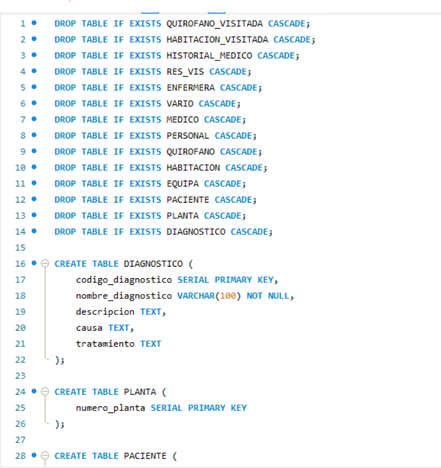

# PROJECTO PROG I BD

## BASE DE DATOS SQL, ENTIDAD RELACION:

para la creacion de la base de datos de la empresa se empleo la siguiente sentencia SQL:


```
{width=width height=height}
```

`<> ER-Relacional-SQL/ZONA_PRUEBAS/SQLhospital_new_and_constrains.sql`
presentacion de la base de dades en entidad relacion:


1. ESQUEMA DE SEGURIDAD (documentos ya hecho añadirlo)
3. ESQUEMA DE ALTA DISPONIBILIDAD (documento ya hecho añadirlo y cambiar la explicacion de instalacion)
4. DUMMY DATA
5. BLOQUE DE EXPORTACION

# MANUAL USUARIO
