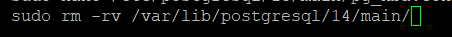
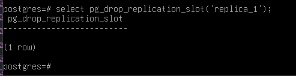
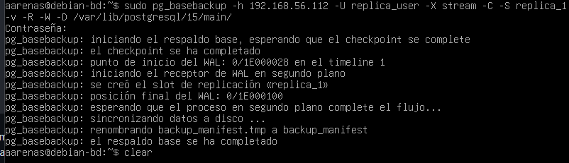
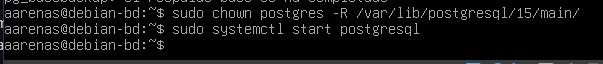

## SOLUCION DE ERROR DE REPLICACION

si el adaptador en ambas maquinas es adaptador puente al cambiar de red la replicacion "fallara", para solucionarlo hacer el siguiente procedimiento:

1. para la el servicio postgresql del servidor secundario "sudo systemctl stop postgresql"
2. eliminar el contenido con la siguiente comanda en la siguiente ruta:

   
3. en el servidor principal eliminar la replica en psql

   

   en este caso la replica se llama replica_1
4. despues conectarse al nodo principal (servidor principal) con la siguiente comanda:

   
5. una vez hecho hacemos la siguiente comanda:

   

   una vez el servicio postgres iniciado lo comprovamos.
6. 

## [Para más informacion de revise el markdown &#34;PROJECTO PROG I BD&#34;](https://github.com/arley02/Treball_Projecte/blob/main/PROJECTO%20PROG%20I%20BD%20.md#esquema-de-seguridad)

revisar el panel para ver en menu:

