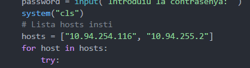

# USO DE EJECUCION SCRIPT

en caso de descargar los ficheros verificar que todos se encuentran en el misma carpeta tambien los usuarios tiene que verificar que el fichero "credenciales" tambien esta creada.

para ejecutar el script es importante ejecutar solo el script "main_login.py"

### importante!!!

en el script "conexion.py" debemos cambiar las ips que se conectan al servidor:

donde pone host cambiamos las ips por las ips de los servidores donde se encuentra alojado la base de datos, en este caso hay dos por que la primera ip es la del servidor principal (NODO 1) y la segunda seria el servidor secundario (NODO 2) diseñado para que en caso que una falle la otra siga ofreciendo conexion.
